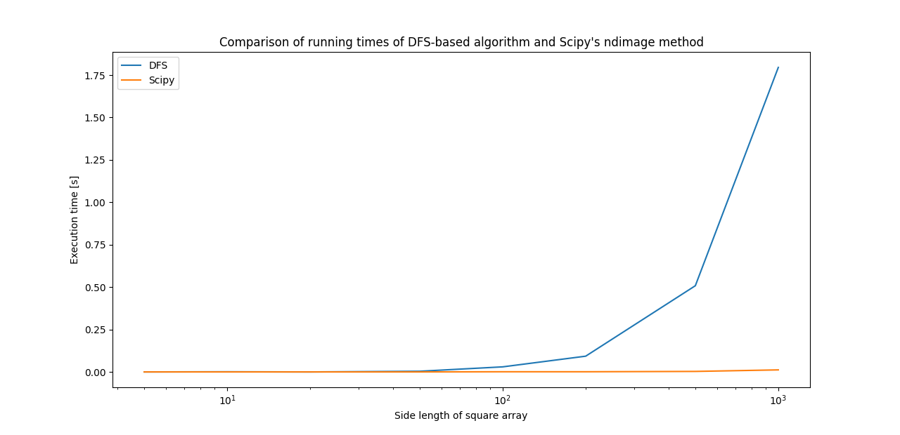

# count_islands
This is a repository for the recruitment task for Silent Eight Pte. Ltd.

# How to use
## Environment requirements
Python 3.7.3. The installation of the following modules is required for
the script to run:
```
numpy==1.21.5
scipy==1.7.3
```

additionaly, to run the comparison.py file:
```
matplotlib==3.5.1
```
(this information is also contained in the requirements.txt file)

## Example invocation (and output)
```
$ sh count_islands.sh tests/test_arrays/proper_islands.txt
5
```
In such case unit tests results are also outputed to `STDERR`.

## Possible error messages
When the file path is not correct:
```
FileNotFoundError("Error: Invalid file path.")
```
When the file has invalid extention:
```
IOError("Error: Invalid file extention.")
```
When the input array has wrong shape:
```
ValueError
```
When the input array has invalid characters:
```
ValueError
```


# The method chosen to count the islands
The first idea on how to count the number of islands in a inputed 2d 
array was to count the number of connected components in an undirected
graph using the DFS (Deep first search) algorithm. Because in the task
we are asked to assume that the size of the data given to us could be
very large, and the DFS algorithm has a running time complexity of
O(m*n), where m and n are rows and columns of the array, the second,
faster idea arose - to use the scipy's ndimage image-processing library.
By `.label()`'ing the islands in the array and coding given
neighbouring-land-fields-to-count-as-island rules in the `structure`
parameter, we can solve the same problem in linear time.

Below the plot of the comparison of running times for both methods for
different data sizes.


So the latter has been chosen for the script. Additionally, as the Scipy
method does not use recurrence, the stack overflow error handling can be
omitted.

The comparison.py file creates the plot.